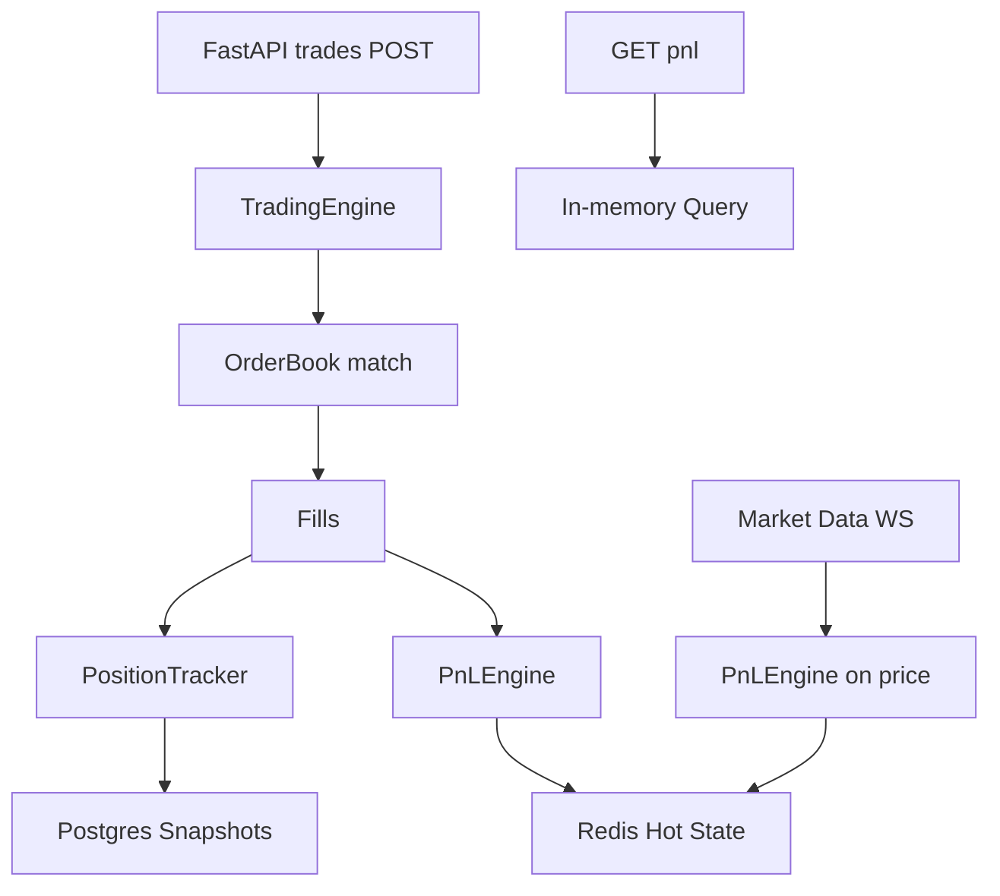

# Trading Primitives

Low-level components for trading systems in Python.

## Components

- **Real-time PnL engine**: Position tracking + realized/unrealized attribution
- **Limit order book**: Price-time priority matching  
- **Position tracker**: Net positions + average cost per account/symbol
- **Trading engine**: Order → match → fill → position → PnL workflow
- **Persistence**: SQLAlchemy models + repository pattern
- **API layer**: FastAPI + Pydantic

Production patterns for finance engineering.

## Quickstart

```bash
docker-compose up -d
uvicorn api.main:app --reload
curl -X POST "http://localhost:8000/trades" \
  -H "Content-Type: application/json" \
  -d '{"symbol": "AAPL", "side": "BUY", "quantity": 100, "price": 150}'
```

## Architecture


## Usage Examples

```python
# End-to-end workflow
from core.trading_engine import SimpleTradingEngine

engine = SimpleTradingEngine("AAPL")
order = Order(order_id=1, side="BUY", quantity=100, price=150)
fills = engine.submit_order("PM1", order)
print(f"Fills: {len(fills)}")
print(f"Total PnL: {engine.pnl_engine.get_total_pnl()}")
```